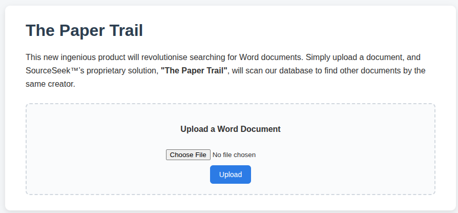
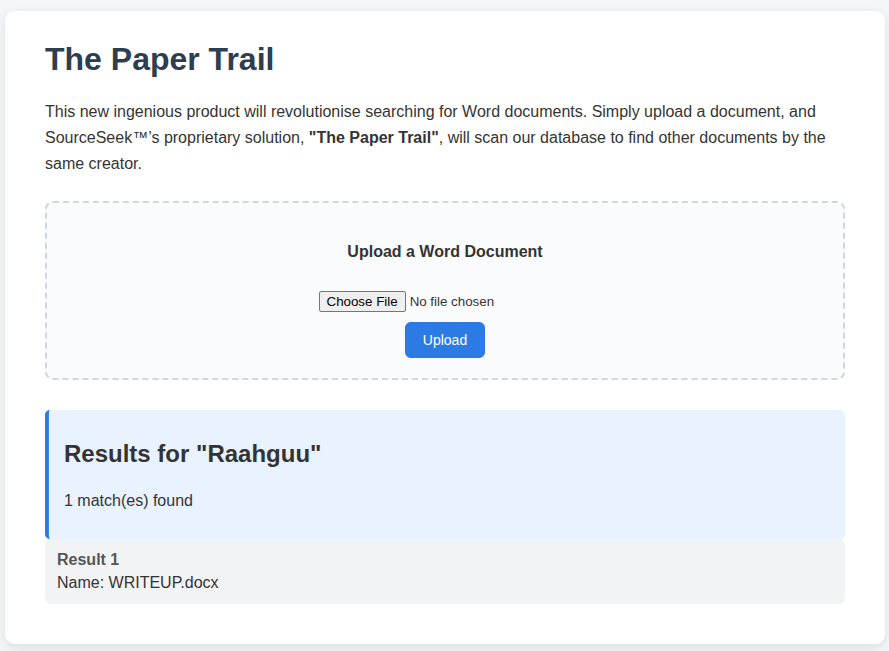
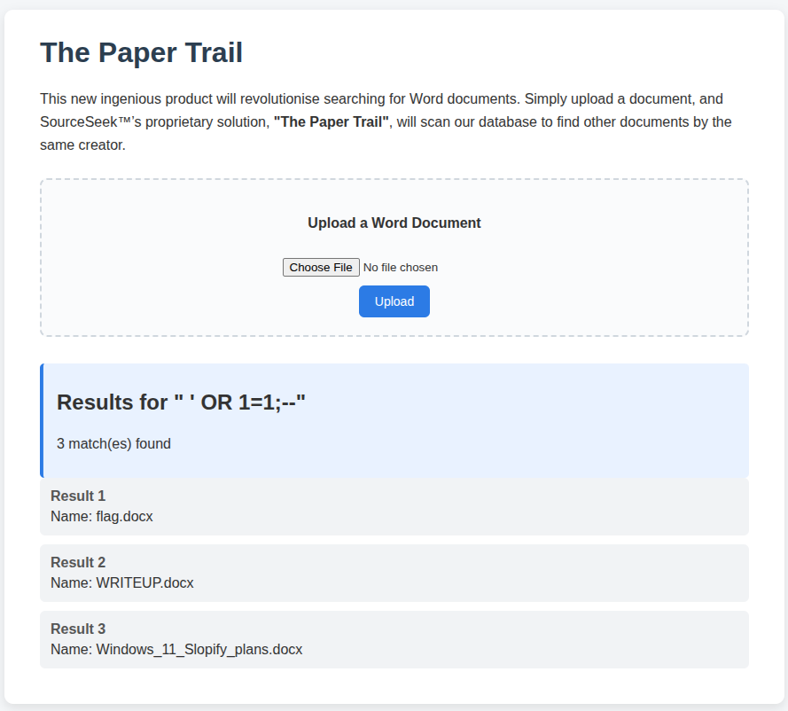
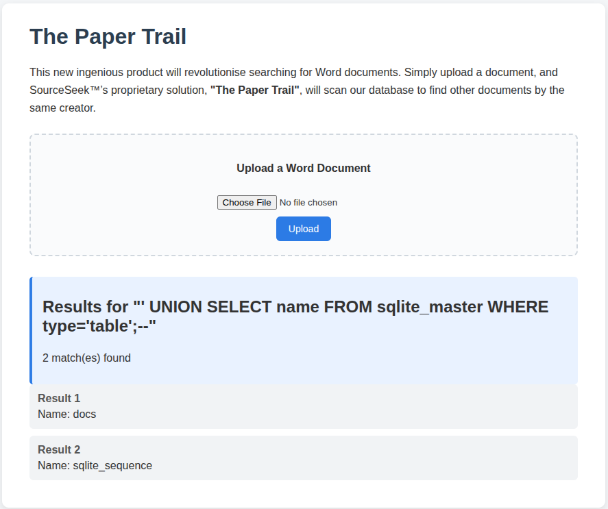
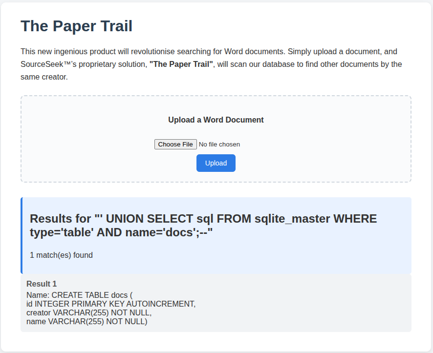
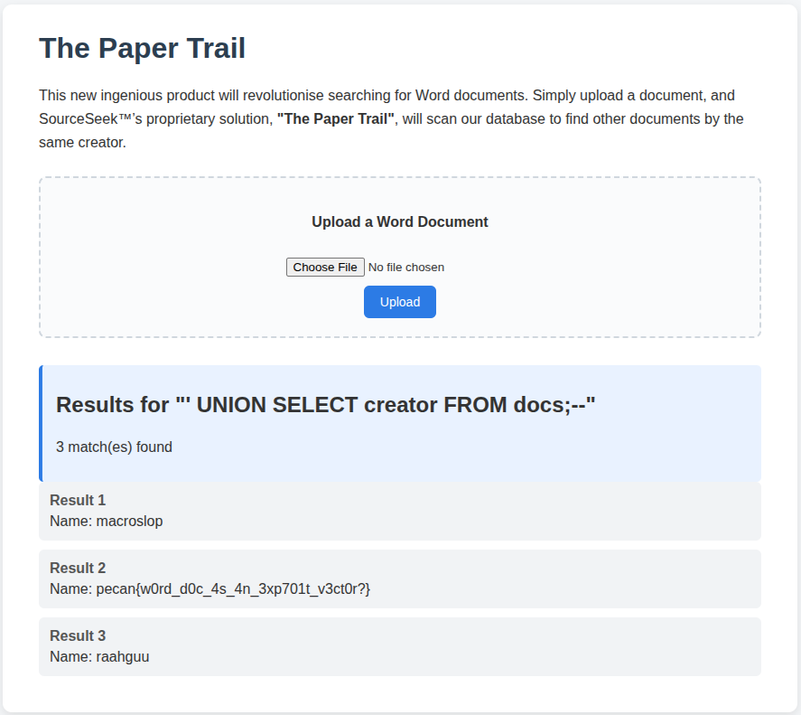

## SQLi Office

This challenge provides you with a website called 'The Paper Trail' which you can upload word documents to and it finds other documents in its database that are from the same 'creator'.



This works by looking at the exif data of a word document, as the title of the challenge uses the word 'SQLi' in it, that is a hint that the challenge will need an SQLi injection.

If the challangee does not have a word document, then they can download one from going to google and dorking with the term 'filetype:docx' in their search request to find a document on google.

As the 'creator' of the document is used, people can see that it is the word documents exif data field 'creator', in order to edit this you need to rename the document to be '\[name\].zip' and unzip it, then within 'docProps' there is 'core.xml' which has the xml tag called '<dc:creator>'

If the 'Creator' tag for this is the same as the creator of the challenge 'Raahguu' you get:


As the challenge title hints an SQLi injection, it is logical to try SQL injections based in this creator tag as the database is clearly searched based on it.

Just doing a basic ` ' OR 1=1;--` results in getting all of the documents back.


As there is one that is 'flag.docx', the only other thing to see is if the other values possibly in other tables or columns within the same table.

So next they need to look at 
```
' UNION SELECT name FROM sqlite_master WHERE type='table';--
```
Finding out that the table's name is `docs`, and that there is only one table


Then getting the column names:
```
' UNION SELECT sql FROM sqlite_master WHERE type='table' AND name='docs';--
```


Then once we know that the column name is `creator`, we can query for the `creator` data in the `docs` table:
```
' UNION SELECT creator FROM docs;--
```

Getting the flag


Therefore you can submit the flag which is:
```
pecan{w0rd_d0c_4s_4n_3xp701t_v3ct0r?}
```
